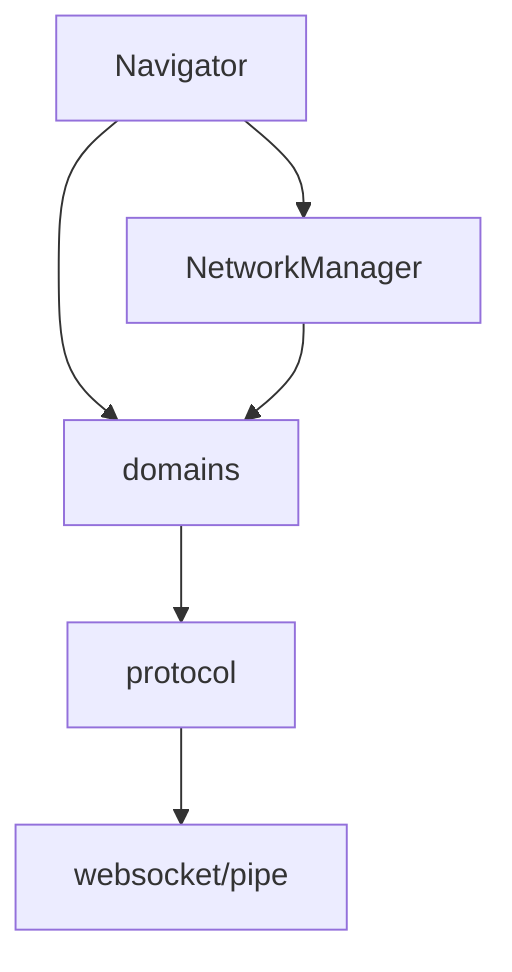

warcbot-cdp
===========

This is a client for the [CDP protocol](https://chromedevtools.github.io/devtools-protocol/). It's not
intended to cover the full full API, just the parts that WarcBot uses. In the future, we might switch to the
[webdriver-bidi protocol](https://github.com/w3c/webdriver-bidi) once it covers everything we need.

There is higher-level Navigator API which  state tracking and the rest of WarcBot should use this rather than calling
CDP domain methods directly.



CDP domain interfaces
---------------------

Each CDP domain that we use is defined as an interface in the [domains package](src/org/netpreserve/warcbot/cdp/domains). The
implementation of these is generated at runtime by a Proxy.


### Asynchronous methods

By default, methods are synchronous for ease of use but sometimes it is useful to call them asynchronously. To enable 
this you methods may return a CompletionStage.


```java
// synchronous: blocks until the browser responds
void continueResponse(RequestId requestId);

// asynchronous: returns immediately after sending the request
CompletionStage<Void> continueResponseAsync(RequestId requestId);
```